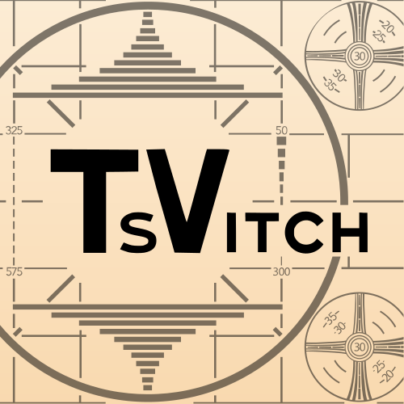
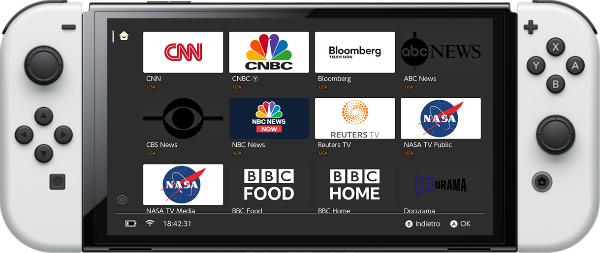

<p align="center">
    
</p>
<p align="center">
  TV finally on Switch
</p>

- - -
<div align="center">


</div>


<div align="center">

</div>
<br>

<p align="center">

</p>


# Introduction

This app turns your Nintendo Switch into a powerful multimedia streaming device. With a user-friendly interface and extensive customization options, you can easily access and enjoy your favorite IPTV channels.

- Access to Your Favorite Content: Supports IPTV playlists in M3U format, enabling streaming of live TV, movies, and on-demand series.
- Optimized Interface: A clean, intuitive design tailored for Nintendo Switch's touchscreen and Joy-Con controls.
- Multilanguage Support: Offers subtitles, multiple audio tracks, and language options for a global audience.

<br>

## Default Playlist

The app comes preloaded with a default playlist sourced from the [Free-TV/IPTV repository](https://github.com/Free-TV/IPTV). This repository provides a wide range of free and publicly available IPTV channels.

### Nintendo Switch


1. Download tsvitch-NintendoSwitch.zip from: [tsvitch releases](https://github.com/giovannimirulla/TsVitch/releases)
2. Place tsvitch.nro in the SD card under the switch directory.
3. On the home screen, hold the R button while opening any game to access hbmenu. From the list, select tsvitch and click to launch.
4. [Optional] Install a desktop shortcut within the app via: Settings/Utilities/User Guide.

# Clone & Build

```shell
# Pulling code
git clone --recursive https://github.com/giovannimirulla/TsVitch.git
cd tsvitch
```

### PC

Currently tsvitch is supported on macOS.

<details>

#### macOS

```shell
# macOS: install dependencies
brew install mpv webp

cmake -B build -DPLATFORM_DESKTOP=ON
make -C build tsvitch -j$(sysctl -n hw.ncpu)
```

</details>

### Cross-compile the Switch executable (tsvitch.nro)

Recommended to use docker build, local build configuration environment is slightly cumbersome, but can be used to switch the underlying ffmpeg or mpv and other dependent libraries for more flexible debugging.

<details>

The following describes the build method under OpenGL. deko3d (better hard solver support) please refer to it: `scripts/build_switch_deko3d.sh`

#### Docker

```shell
docker run --rm -v $(pwd):/data devkitpro/devkita64:20240202 \
  bash -c "/data/scripts/build_switch.sh"
```

#### 本地编译

```shell
# 1. Install the devkitpro environment: https://github.com/devkitPro/pacman/releases

# 2. Installation of dependencies
sudo dkp-pacman -S switch-glfw switch-libwebp switch-cmake switch-curl devkitA64

# 3. Installing custom dependencies
base_url="https://github.com/xfangfang/wilwili/releases/download/v0.1.0"
sudo dkp-pacman -U \
    $base_url/switch-ffmpeg-7.1-1-any.pkg.tar.zst \
    $base_url/switch-libmpv-0.36.0-3-any.pkg.tar.zst

# 4. Build
cmake -B cmake-build-switch -DPLATFORM_SWITCH=ON
make -C cmake-build-switch tsvitch.nro -j$(nproc)
```

</details>

# Disclaimer
This project is for educational purposes only. The author is not responsible for any damage caused by the use of this project. Please comply with the laws of your country.

This app does not host or provide any IPTV content. Users are responsible for ensuring their playlists contain only legal and authorized content.

# Acknowledgement

The development of tsvitch cannot do without the support of the following open source projects.

- Toolchain: devkitpro, switchbrew, vitasdk OpenOrbis and PacBrew
    - https://github.com/devkitPro
    - https://github.com/switchbrew/libnx
    - https://github.com/vitasdk
    - https://github.com/OpenOrbis
    - https://github.com/PacBrew
- UI Library: natinusala and XITRIX
    - https://github.com/natinusala/borealis
    - https://github.com/XITRIX/borealis
- Video Player: Cpasjuste, proconsule fish47 and averne
    - https://github.com/Cpasjuste/pplay
    - https://github.com/proconsule/nxmp
    - https://github.com/fish47/FFmpeg-vita
    - https://github.com/averne
- wiliwili
    - https://github.com/xfangfang/wiliwili
- Misc
    - https://github.com/nlohmann/json
    - https://github.com/nayuki/QR-Code-generator
    - https://github.com/BYVoid/OpenCC
    - https://github.com/imageworks/pystring
    - https://github.com/sammycage/lunasvg
    - https://chromium.googlesource.com/webm/libwebp
    - https://github.com/fancycode/MemoryModule
    - https://github.com/dacap/clip